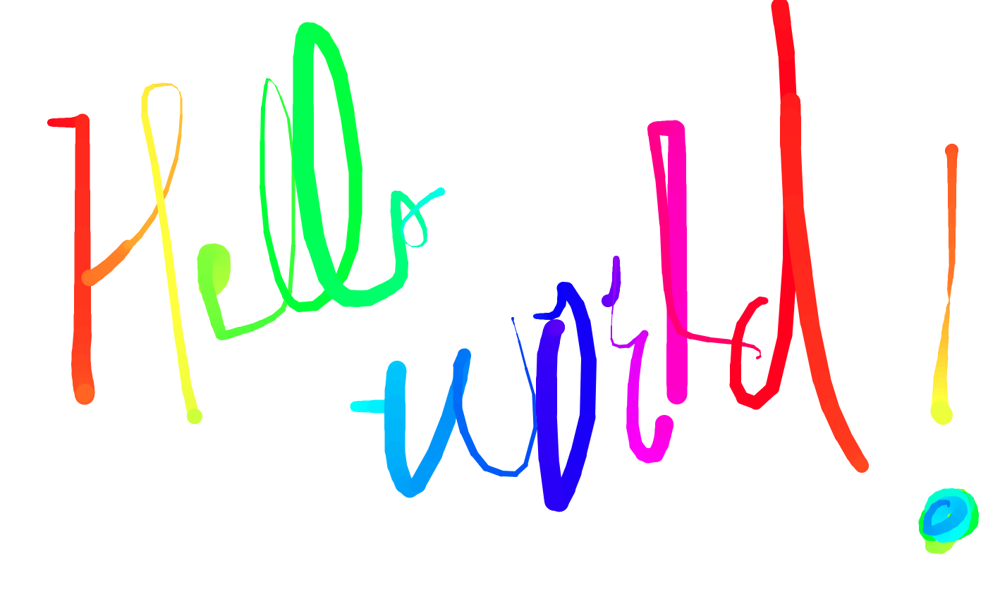

# html-canvas

## Description
An application utilizing Javascript that allows you to draw on the browser.

## Credits
This was created via watching the Wes Bos - Javascript 30 course.

## Badge

## License 
Copyright 2020 - Ryan Flanagan

